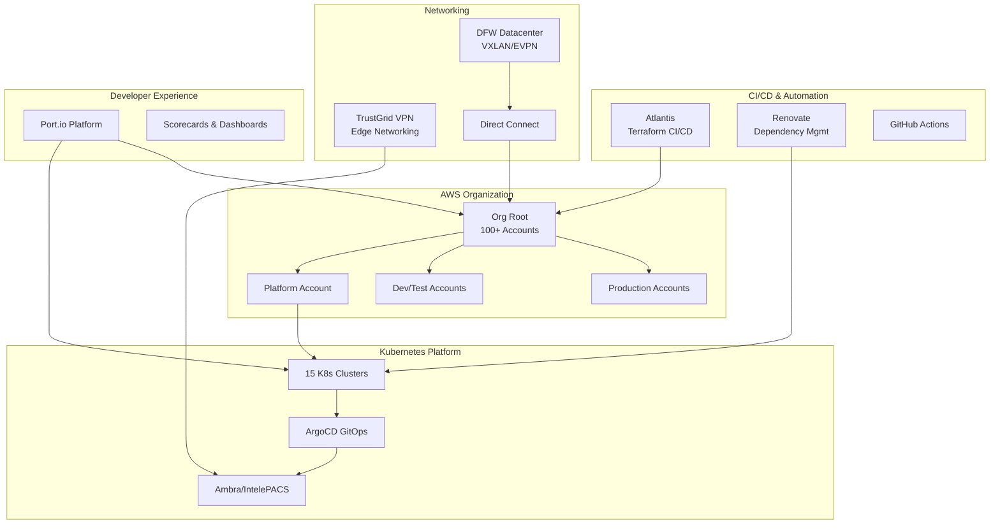

# Platform Architecture Overview

## System Architecture

The Intelerad Platform Engineering infrastructure spans multiple cloud providers and on-premises datacenters, providing a robust foundation for our medical imaging applications.

## High-Level Architecture

## Core Components

### Infrastructure as Code (Terraform)
- **30+ Reusable Modules** - Standardized AWS resource patterns
- **100+ AWS Accounts** - Managed via terraform across organization
- **Atlantis CI/CD** - Automated terraform plan/apply via PR workflow
- **S3 State Backend** - Centralized state management with locking

**Key Modules:**
- Composition modules for complete environment stacks
- Atomic AWS resource modules (ACM, Route53, VPC, etc.)
- Common utilities (tagging, VPC discovery, IAM policies)

**Learn More:** [How to Create a Terraform Module](../how-to/create-terraform-module.md)

---

### Kubernetes Platform
- **15 Production Clusters** - Running Ambra/IntelePACS medical imaging software
- **ArgoCD GitOps** - Automated application deployment and sync
- **Renovate** - Automated dependency updates for helm charts and images
- **Multi-Cluster Management** - Standardized configuration across environments

**Cluster Distribution:**
- Per-environment isolation (dev, staging, prod)
- Geographic distribution for latency optimization
- Customer-specific clusters for data isolation

**Learn More:** *[K8s documentation coming soon]*

---

### Network Architecture

#### DFW Datacenter (Greenfield Build)
- **VXLAN/EVPN Fabric** - Layer 2/3 overlay network
- **BGP Routing** - iBGP/eBGP with route reflectors (AS13649)
- **Cisco Nexus** - Spine-leaf architecture
- **Ansible Automation** - Network device configuration management

#### TrustGrid VPN
- **Edge Networking** - Secure connectivity for PACS deployments
- **Load Balancer Automation** - Route53-based failover
- **Terraform Managed** - Day-2 operations via IaC

#### AWS Connectivity
- **Direct Connect** - Dedicated network connections to AWS
- **Transit Gateway** - Hub-and-spoke multi-account networking
- **AWS IPAM** - Centralized IP address management

**Learn More:** *[Network architecture docs coming soon]*

---

### Developer Portal (Port.io)
- **Service Catalog** - Visibility into all services and infrastructure
- **Scorecards** - Automated compliance and best practice checks
- **GitHub Integration** - Repository health dashboards
- **AWS Integration** - Resource discovery and tagging enforcement

**Scorecards Monitor:**
- SSM agent enrollment on EC2 instances
- Resource tagging compliance
- Repository branch health
- Security best practices

---

### CI/CD Pipeline

#### Terraform (Atlantis)
- **PR-Based Workflow** - Plan on PR, apply on merge
- **Multi-Workspace Support** - Handles 100+ terraform workspaces
- **State Locking** - Prevents concurrent modifications
- **Running on K8s** - Migrated from ECS (see [ADR-001](adr/001-atlantis-migration-ecs-to-eks.md))

**Runbook:** [Atlantis Down](../runbooks/atlantis-service-down.md)

#### Kubernetes (ArgoCD)
- **GitOps Pattern** - Git as source of truth
- **ApplicationSets** - Multi-cluster application templating
- **Auto-Sync** - Automated deployment on git changes
- **Rollback Support** - Easy revert to previous versions

---

## Design Principles

### 1. Everything as Code
- Infrastructure (Terraform)
- Application deployments (Helm/Kustomize)
- Network configuration (Ansible)
- Documentation (Markdown in Git)

### 2. Self-Service Where Possible
- Developers deploy their own applications via GitOps
- Automated dependency updates via Renovate
- Port.io for visibility without asking

### 3. Security by Default
- All S3 buckets private by default
- Encryption at rest (KMS or AES256)
- SSM agent required on all EC2 instances
- Public access blocked via SCPs

### 4. Observable and Measurable
- Scorecards track compliance
- Monitoring and alerting for critical services
- Metrics on infrastructure health

### 5. Automation Over Toil
- Atlantis for terraform (not manual applies)
- Renovate for dependencies (not manual PRs)
- ArgoCD for deployments (not kubectl)

---

## Technology Stack

### Infrastructure
- **Cloud:** AWS (primary), Azure, GCP
- **IaC:** Terraform, Ansible
- **Networking:** Cisco Nexus, TrustGrid, AWS Transit Gateway

### Kubernetes
- **Distributions:** RKE2, K3s, EKS Anywhere
- **GitOps:** ArgoCD
- **Package Manager:** Helm
- **Dependency Mgmt:** Renovate

### CI/CD
- **Terraform:** Atlantis
- **Kubernetes:** ArgoCD
- **General:** GitHub Actions

### Monitoring & Observability
- **Platform:** Port.io
- **Metrics:** Prometheus, Grafana *(planned)*
- **Logging:** *(planned)*

---

## Architecture Decision Records

All major architectural decisions are documented as ADRs. Browse the [ADR directory](adr/) to understand why we've made specific technical choices.

**Recent ADRs:**
- [ADR-001: Atlantis Migration from ECS to EKS](adr/001-atlantis-migration-ecs-to-eks.md)

---

## Related Documentation
- [ADRs](adr/) - Architecture decision records
- [Runbooks](../runbooks/) - Operational procedures
- [How-To Guides](../how-to/) - Implementation guides

---

**Last Updated:** 2025-11-17
**Owner:** Platform Engineering Team
