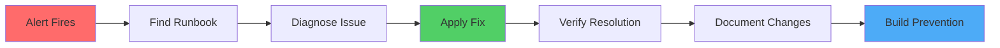

# Runbooks

## What is a Runbook?

A **runbook** is a step-by-step operational procedure for handling incidents, outages, maintenance tasks, or risky operations.

Runbooks help us:
- 🚨 Respond to incidents quickly and consistently
- 📖 Reduce cognitive load during high-stress situations
- 🎓 Enable anyone on-call to handle common issues
- 📊 Identify patterns and prevent recurring problems

## When to Use Runbooks

Use runbooks when:
- **Service is down** - Follow diagnosis and resolution steps
- **Alert fired** - Understand what it means and how to fix it
- **On-call** - Quick reference for common issues
- **Maintenance** - Step-by-step for risky operations

## Available Runbooks

### Critical (P0/P1)
| Runbook | Severity | Updated |
|---------|----------|---------|
| [Atlantis Service Down](atlantis-service-down.md) | P1 | 2025-11-17 |

### Important (P2)
*No runbooks yet*

### Maintenance & Operations
*No runbooks yet*

---

## Runbook Format

Each runbook includes:
- **Severity & Impact** - How urgent is this?
- **Symptoms** - What you'll see when this happens
- **Diagnosis Steps** - How to identify the root cause
- **Resolution** - Step-by-step fix instructions
- **Verification** - How to confirm it's fixed
- **Prevention** - What to build to avoid recurrence

---

## Creating a Runbook

### After an Incident
1. **Document what happened** while it's fresh
2. **Use the template** from plt-modules repo
3. **Include actual commands** you ran
4. **Add prevention steps** to avoid future occurrences
5. **Get review** from incident participants
6. **Commit within 48 hours** of incident resolution

**Template:** [Runbook Template](https://github.com/intelerad-org/plt-modules/blob/main/docs/runbooks/template.md)

### For Planned Operations
1. **Document before** the first time you perform it
2. **Test the procedure** in dev/staging
3. **Include rollback steps**
4. **Add verification checks**
5. **Review with team** before using in production

---

## Runbook Best Practices

### Do ✅
- **Write during/after incidents** while details are fresh
- **Use exact commands** with copy-paste ready syntax
- **Include expected output** so you know if it worked
- **Document prevention** - what should we build?
- **Test runbooks** - do they actually work?
- **Keep updated** - mark with last-tested date

### Don't ❌
- Don't assume prior knowledge - write for anyone on-call
- Don't skip the "why" - explain what commands do
- Don't forget verification steps
- Don't ignore recurring incidents - automate the fix
- Don't let runbooks go stale - review quarterly

---

## Incident Response Process

1. **Alert fires** → Check monitoring
2. **Find runbook** → Search by service/symptom
3. **Diagnose** → Follow diagnosis steps
4. **Apply fix** → Execute resolution steps
5. **Verify** → Confirm issue resolved
6. **Document** → Note what you did
7. **Prevent** → Build automation to prevent recurrence

---

## On-Call Quick Reference

### P0 - Critical (Service Down)
- **Atlantis Down** → [Runbook](atlantis-service-down.md)
- **K8s Cluster Unreachable** → *[Runbook needed]*
- **Production Outage** → *[Runbook needed]*

### P1 - High (Degraded Service)
- **Terraform State Locked** → *[Runbook needed]*
- **Slow Deployments** → *[Runbook needed]*

### P2 - Medium (Non-urgent Issues)
- **Certificate Expiring** → *[Runbook needed]*
- **Capacity Warning** → *[Runbook needed]*

---

## Runbooks We Need

Help us build our runbook library! High-priority runbooks needed:

- [ ] Terraform state locked - can't deploy
- [ ] K8s cluster unreachable
- [ ] ArgoCD not syncing applications
- [ ] AWS account provisioning
- [ ] Certificate renewal procedure
- [ ] Direct Connect outage
- [ ] TrustGrid gateway down

Pick one and create a PR!

---

## Related Resources
- [Architecture Overview](../architecture/overview.md)
- [How-To Guides](../how-to/)
- [ADRs](../architecture/adr/)

---

**Need help during an incident?**
- Slack: #platform-incidents
- PagerDuty: @platform-oncall
- Phone: Check PagerDuty for on-call rotation
