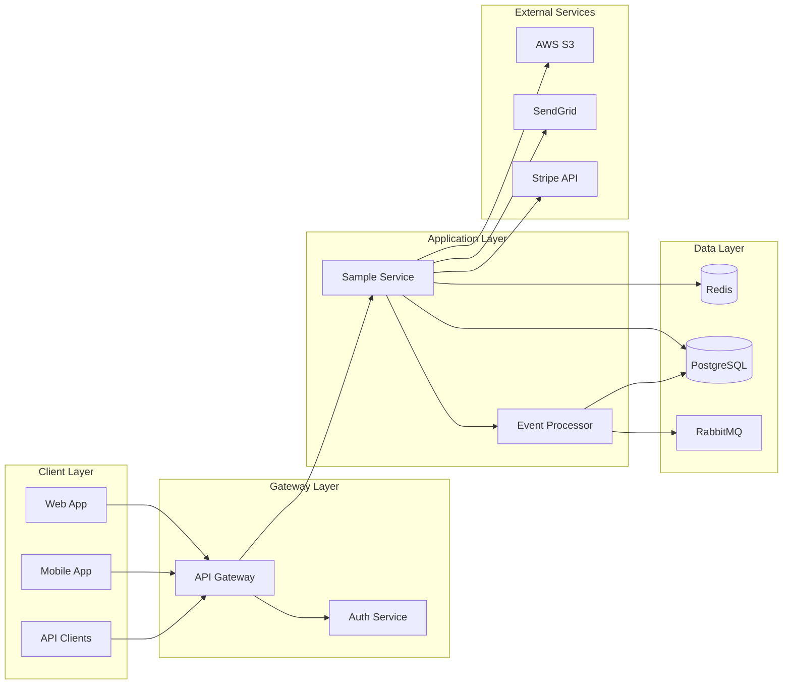

# Architecture Overview

## System Architecture

Sample Service is built using a microservices architecture with event-driven patterns for scalability and resilience.

## High-Level Design



## Core Components

### API Server

**Purpose**: Handle HTTP requests and business logic

**Responsibilities**:
- Request validation and sanitization
- Authentication and authorization
- Business logic execution
- Response formatting
- Error handling

**Technology**: Express.js with TypeScript

**Scaling**: Horizontal scaling with load balancer

### Event Processor

**Purpose**: Handle asynchronous background jobs

**Responsibilities**:
- Process messages from queue
- Execute long-running tasks
- Send notifications
- Data synchronization
- Retry failed operations

**Technology**: Node.js worker processes

**Scaling**: Multiple worker instances

### Database Layer

**Purpose**: Persistent data storage

**Components**:
- **PostgreSQL**: Primary data store
- **Redis**: Session storage and caching
- **S3**: File and blob storage

**Data Flow**:
1. Write operations go to PostgreSQL
2. Frequently accessed data cached in Redis
3. Large files stored in S3

## Design Patterns

### Repository Pattern

Abstracts data access logic:

```typescript
interface UserRepository {
  findById(id: string): Promise<User | null>
  save(user: User): Promise<void>
  delete(id: string): Promise<void>
}
```

### Service Layer

Encapsulates business logic:

```typescript
class OrderService {
  constructor(
    private orderRepo: OrderRepository,
    private paymentGateway: PaymentGateway,
    private eventBus: EventBus
  ) {}

  async createOrder(data: CreateOrderDto): Promise<Order> {
    // Business logic here
  }
}
```

### Event-Driven Architecture

Decouples components using events:

```typescript
// Publisher
eventBus.publish('order.created', {
  orderId: order.id,
  userId: order.userId,
  amount: order.total
})

// Subscriber
eventBus.subscribe('order.created', async (event) => {
  await notificationService.sendOrderConfirmation(event)
})
```

### Circuit Breaker

Prevents cascading failures:

```typescript
const paymentCircuit = new CircuitBreaker(paymentGateway.charge, {
  timeout: 5000,
  errorThresholdPercentage: 50,
  resetTimeout: 30000
})
```

## Data Models

### User

```typescript
interface User {
  id: string
  email: string
  name: string
  role: 'admin' | 'user' | 'guest'
  createdAt: Date
  updatedAt: Date
}
```

### Order

```typescript
interface Order {
  id: string
  userId: string
  items: OrderItem[]
  total: number
  status: 'pending' | 'processing' | 'completed' | 'failed'
  createdAt: Date
  updatedAt: Date
}
```

## API Design

### RESTful Principles

- Resources identified by URLs
- Standard HTTP methods (GET, POST, PUT, DELETE)
- Stateless communication
- JSON response format

### Versioning

API versions included in URL path:

```
/api/v1/users
/api/v2/users
```

### Pagination

Cursor-based pagination for large datasets:

```json
{
  "data": [...],
  "pagination": {
    "cursor": "eyJpZCI6MTIzfQ==",
    "hasMore": true
  }
}
```

## Security Architecture

### Authentication

- JWT tokens for API authentication
- OAuth 2.0 for third-party integrations
- Session-based auth for web applications

### Authorization

Role-based access control (RBAC):

```typescript
const permissions = {
  'admin': ['read', 'write', 'delete'],
  'user': ['read', 'write'],
  'guest': ['read']
}
```

### Data Protection

- Encryption at rest (AES-256)
- TLS 1.3 for data in transit
- Secrets stored in AWS Secrets Manager
- PII data masked in logs

## Performance Considerations

### Caching Strategy

**L1 Cache (In-Memory)**:
- Hot data cached in application memory
- TTL: 5 minutes
- Eviction: LRU

**L2 Cache (Redis)**:
- Shared cache across instances
- TTL: 1 hour
- Cluster mode for high availability

### Database Optimization

- Indexed columns for frequent queries
- Read replicas for read-heavy operations
- Connection pooling (max 20 connections)
- Query timeout: 5 seconds

### Rate Limiting

- 100 requests per minute per IP
- 1000 requests per hour per API key
- Sliding window algorithm

## Monitoring and Observability

### Metrics

- Request rate and latency (p50, p95, p99)
- Error rate by endpoint
- Database query performance
- Cache hit ratio
- Queue depth

### Logging

Structured JSON logging:

```json
{
  "timestamp": "2025-11-19T10:30:00Z",
  "level": "info",
  "service": "sample-service",
  "traceId": "abc123",
  "message": "Order created",
  "orderId": "order-456",
  "userId": "user-789"
}
```

### Tracing

Distributed tracing with Datadog APM:
- Trace every request across services
- Identify bottlenecks
- Track error propagation

## Deployment Architecture

### Infrastructure

- **Cloud Provider**: AWS
- **Container Orchestration**: ECS on Fargate
- **Load Balancer**: Application Load Balancer
- **CDN**: CloudFront

### Environments

| Environment | Purpose | Auto-deploy |
|-------------|---------|-------------|
| dev | Development testing | Yes (on push to main) |
| staging | Pre-production testing | Yes (on tag) |
| production | Live system | Manual approval |

### CI/CD Pipeline

1. Code pushed to GitHub
2. GitHub Actions runs tests
3. Build Docker image
4. Push to ECR
5. Deploy to ECS (if tests pass)
6. Run smoke tests
7. Rollback if health checks fail

## Disaster Recovery

### Backup Strategy

- **Database**: Daily backups, 30-day retention
- **Redis**: Persistence enabled (RDB + AOF)
- **Configuration**: Stored in git

### Recovery Procedures

**RTO (Recovery Time Objective)**: 1 hour

**RPO (Recovery Point Objective)**: 15 minutes

**Steps**:
1. Detect failure via monitoring
2. Assess impact and scope
3. Execute recovery playbook
4. Restore from backup if needed
5. Verify system health
6. Post-incident review

## Scalability

### Horizontal Scaling

- API servers: Auto-scale 2-10 instances
- Workers: Auto-scale 1-5 instances
- Database: Read replicas for scaling reads

### Vertical Scaling

- Database: Upgrade instance class if needed
- Cache: Increase memory allocation

### Capacity Planning

Current capacity:
- 10,000 requests/second
- 1M daily active users
- 100GB database size

Growth projections reviewed quarterly.

## Future Enhancements

- [ ] Migrate to Kubernetes for better orchestration
- [ ] Implement GraphQL API for flexible querying
- [ ] Add real-time features with WebSockets
- [ ] Multi-region deployment for global users
- [ ] Machine learning for fraud detection

## References

- [ADR: Choosing PostgreSQL over MongoDB](adr/001-database-choice.md)
- [ADR: Event-Driven Architecture](adr/002-event-driven.md)
- [API Documentation](../api/endpoints.md)
- [Deployment Guide](../how-to/deploy.md)
