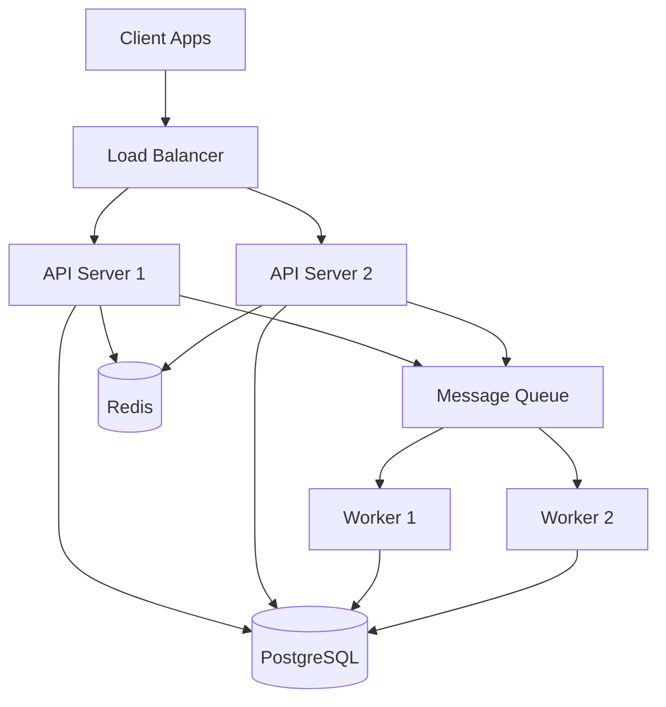

# Sample Service Documentation

Welcome to the Sample Service documentation! This service demonstrates best practices for service documentation that will be aggregated into the platform documentation site.

## Overview

Sample Service is a microservice that handles business-critical operations including:

- Data processing and transformation
- External API integrations
- Event-driven workflows
- Real-time data synchronization

## Quick Links

- [Architecture Overview](architecture/overview.md) - System design and components
- [API Documentation](api/endpoints.md) - REST API reference
- [Runbooks](runbooks/incident-response.md) - Operational procedures
- [How-To Guides](how-to/local-development.md) - Step-by-step instructions

## Key Features

### High Performance
Built with scalability in mind, handling thousands of requests per second with sub-100ms latency.

### Reliability
- 99.9% uptime SLA
- Automatic failover and recovery
- Circuit breaker patterns
- Comprehensive monitoring and alerting

### Security
- OAuth 2.0 authentication
- Role-based access control (RBAC)
- Data encryption at rest and in transit
- Regular security audits

## Technology Stack

| Component | Technology | Purpose |
|-----------|------------|---------|
| Runtime | Node.js 20 | Application server |
| Framework | Express.js | Web framework |
| Database | PostgreSQL 15 | Primary data store |
| Cache | Redis 7 | Session and data caching |
| Message Queue | RabbitMQ | Async job processing |
| Monitoring | Datadog | Observability |

## Getting Started

### Prerequisites

- Node.js 20+
- Docker & Docker Compose
- PostgreSQL 15+
- Redis 7+

### Quick Start

```bash
# Clone the repository
git clone https://github.com/your-org/sample-service.git
cd sample-service

# Install dependencies
npm install

# Set up environment
cp .env.example .env

# Start local dependencies
docker-compose up -d

# Run migrations
npm run migrate

# Start the service
npm run dev
```

The service will be available at `http://localhost:3000`.

### Running Tests

```bash
# Unit tests
npm test

# Integration tests
npm run test:integration

# E2E tests
npm run test:e2e

# Coverage report
npm run test:coverage
```

## Architecture



## Support

- **On-Call**: Use PagerDuty for urgent issues
- **Slack**: #sample-service-support
- **Documentation**: This site
- **Repository**: https://github.com/your-org/sample-service

## Contributing

See [CONTRIBUTING.md](https://github.com/your-org/sample-service/blob/main/CONTRIBUTING.md) in the repository.

## Changelog

See [CHANGELOG.md](https://github.com/your-org/sample-service/blob/main/CHANGELOG.md) for recent changes.

## License

MIT License - See LICENSE file for details.
